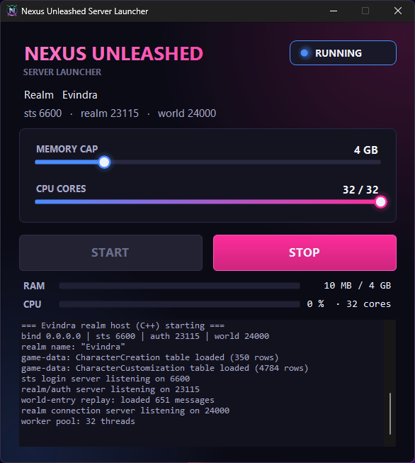

# NexusUnleashed

> ## 💬 A note from **NU-Dev**
>
> ### _“I told you I did not need your code.”_

A **standalone**, clean-room WildStar server engine — built from the client, our
own restoration data, and the observable behavior of a running reference realm,
**owing no upstream license, no fork, and no other project anything.**

> **Standalone means standalone.** This is not a fork, not a patch set, not a
> plugin, and not a wrapper around someone else's server. It does not import,
> link, depend on, or descend from NexusForever or any other emulator. It boots on
> its own, speaks the WildStar protocol on its own, and carries its own data — a
> complete server you can clone, build, and run by itself. Every layer, from the
> crypto to the world simulation, is our own code (with two small MIT primitives,
> attributed). **0 lines of NexusForever source.**

  

  
   
  <em><b>nusl.exe</b> — the Nexus Unleashed Server Launcher: one-click start/stop, a hard memory
  cap, CPU-core control, and live CPU/RAM monitoring. Native, no runtime, no dependencies.</em>

> ### 🟢 Milestone — 2026-08-20: **a character created on this engine persists and renders — its whole look decoded from Carbine's own tables.**
> A retail WildStar 16042 client creates a character on NexusUnleashed and it **saves to the
> database, comes back correct, and renders** — race, class, faction, level, and a **full custom
> appearance**: the player's face / hair / skin / ear choices are decoded straight out of the
> create packet and resolved through the client's own customization tables, then drawn by the
> client at character select. Character **management is complete too — create, delete, and realm
> selection (list, name, type, status) — all working live.** The realm-lane packet cipher that
> hid everything past login was cracked from the client itself. **0 lines of NexusForever. Not
> the protocol read back at a test — a real client, on our engine, building and rendering a
> character.** Next stop: the world.

## Why this exists: escaping the AGPL

**This entire project has one reason to exist — to get out from under the AGPL-3.0.**

Every existing WildStar server descends from NexusForever, which is licensed
[AGPL-3.0](https://www.gnu.org/licenses/agpl-3.0.en.html) — a strong copyleft that
reaches through networks: run a modified AGPL server and you owe your source to
everyone who touches it, forever, under the same terms. That license became a
leash. NexusUnleashed cuts it.

We are rebuilding the entire server **clean-room** — from Carbine's own client, our
own data, and the observable behavior of a running realm — so that **not one line
descends from AGPL code.** The protocol, the opcodes, and the file formats are
uncopyrightable facts defined by the client, free for anyone to implement; the
implementation is 100% ours. The result is a WildStar server that answers to
**no copyleft, no upstream, and no gatekeeper** — and that we release under the
permissive **MIT** license, so it is genuinely free for everyone, forever.

That is the whole point. Every phase below is a step toward a fully working
WildStar server that owes the AGPL nothing.

## The road to standing in the world

The only definition of done is **a real client, logged into this engine, standing
in the world.** Everything else is subordinate to it. Here's the distance closing,
in the open, in real time:

| Phase | | Status |
|---|---|---|
| **01 · The Break** | Clean MIT split from the AGPL; public from commit one | ✅ Done |
| **02 · Foundation** | SRP login, bit-packed wire codec, 384 client tables typed, real accounts, Linux binary | ✅ Done |
| **03 · The Living World** | 263,756 entities, all 2,729 worlds resident at once, vision + movement + aggro + combat | ✅ Done |
| **04 · The Wire** | 157 opcodes captured from real play, codec **validated on real packets**, entity position decoded | ✅ Done |
| **05 · The Encryption Gate** | Encrypted channel open: SRP session key, the ARC4 login stream, the two-phase game cipher — cracked from the client | ✅ Done |
| **06 · The Handshake** | Real 16042 client: STS login → realm → served its character list → runs the whole creator (Experience → Race → Class → Path → Customize → Finalize) → **creates a character that persists and renders** — race/class/faction/level and a full custom appearance decoded from the client's own tables — with **delete and realm selection**, all live and screenshot-proven | ✅ Done |
| **07 · World Entry** | The real client **enters the 3D world**, server-native (no Frida): the world-load completeness mask (`session+31560` → `0x7F`) fully RE'd and driven by `0x00AD`+`0x00F1`+`0x0262`+`0x019B`+`0x0061` with a `0x0845` keepalive — the character renders as a **full Aurin-female body** in the arkship Medbay, all from the client + our DB | ✅ Done |
| **★ The North Star** | **You, standing in the world — on our engine, not theirs** | ◑ **In the world; standing-pose polish underway** |
| **08 · World-entry polish** | Standing pose · exact floor Y · per-character appearance from the DB · then the living world (movement, entities, combat, quests) | 🔶 **In progress** |

> Not the engine reading the protocol. Not a green test. A real client rendering a
> living world on the NexusUnleashed engine. That is done — and nothing sourced from
> NexusForever gets us there: the protocol comes from Carbine's client and the wire,
> the implementation is entirely ours.

## Take it. It's yours too.

**This project is [MIT-licensed](LICENSE), and we mean it in the most open way a
license can be read.** Use it, fork it, don't fork it, rip out one file or the
whole engine, build a commercial thing on it, build a hobby realm on it — you
need no one's permission and you owe no one an explanation. There is no
"contribute back" obligation, no gatekeeping, no private branch you have to earn
access to. Every commit is public from the first line.

Credit is appreciated, never required. If NexusUnleashed helps your project,
that's the entire point of putting it here. Nobody should have to negotiate for
access to a WildStar server — and with this repo, nobody does.

- `ARCHITECTURE.md` — the constitution: mission, the Provenance Discipline, the
  build order.
- `OPTIMIZATION.md` — the performance manifesto: the standard this engine is
  built to — lean, fast, and scalable to the entire game running at once.
- `provenance/` — the ledger proving every component's clean origin.
- `spec/` — behavior specifications (the only thing that crosses from analysis
  to implementation).
- `parity/` — the harness that proves this engine is indistinguishable from the
  frozen realm on the wire.
- `Content/` — the world data (263,756 entities, kits, floors, transport),
  loaded unchanged.

The restoration data, the tools, and the knowledge are ours and free. This
engine makes the whole stack ours.
